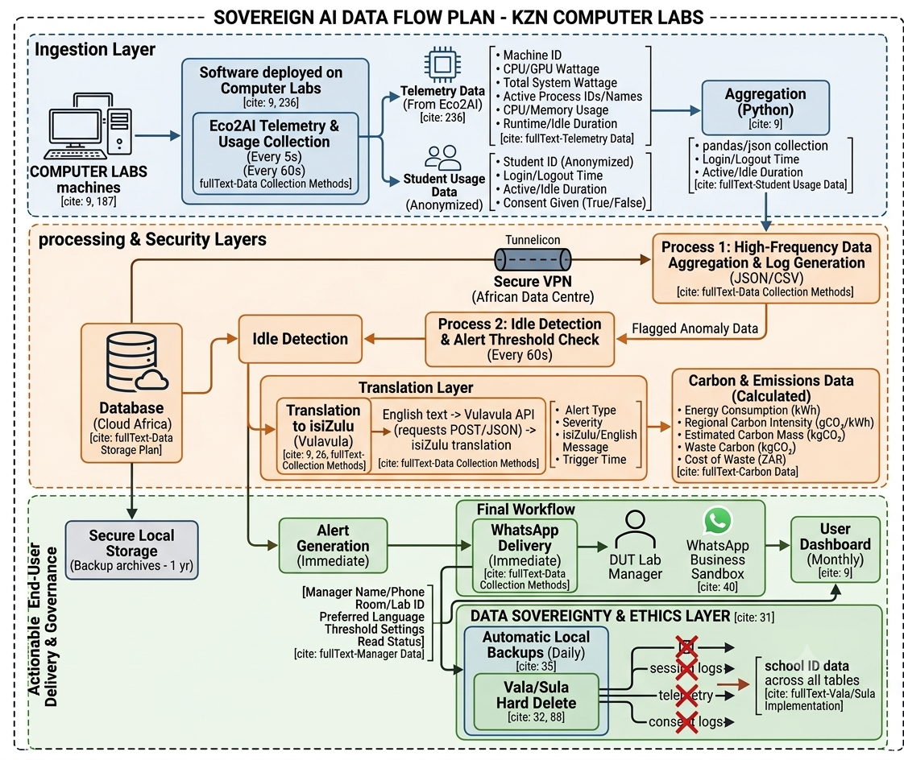

### Background
To build our Sovereign AI system for carbon footprint hotspot detection, we need a clear understanding of:

1. **WHAT** data we need to collect
2. **WHY** we need each piece of data
3. **HOW** we will collect it
4. **WHERE** it will be stored
5. **HOW LONG** it will be kept

---

## 📊 DATA REQUIREMENTS DICTIONARY

### 1. Telemetry Data (From Eco2AI)

| Field | Type | Why We Need It | How We Collect | Format |
|-------|------|----------------|----------------|--------|
| **Machine ID** | String | Identify which computer is wasting energy | Unique identifier assigned to each lab computer | `LAB-14B-PC-01` |
| **CPU Wattage** | Float (W) | Measure processor energy consumption | Eco2AI reads from `/sys/class/powercap/` | `45.2 W` |
| **GPU Wattage** | Float (W) | Measure graphics card energy consumption | Eco2AI reads from NVIDIA/CUDA or Intel power cap | `120.5 W` |
| **Total System Wattage** | Float (W) | Overall energy draw of the machine | Eco2AI aggregate calculation | `185.7 W` |
| **Active Process IDs** | Array[Int] | Know what applications are running | `ps aux` command parsing | `[1234, 5678, 9012]` |
| **Process Names** | Array[String] | Identify specific apps causing high energy | Process ID mapping to names | `["chrome", "python", "zoom"]` |
| **CPU Usage %** | Float (%) | Measure how busy the processor is | `/proc/stat` readings | `67.3%` |
| **Memory Usage** | Float (GB) | Track memory consumption | `free -m` command | `4.2 GB` |
| **Runtime Duration** | Float (seconds) | How long has computer been on | System uptime tracking | `84600 sec (23.5 hours)` |
| **Idle Time** | Float (seconds) | Time computer is on but not in use | Active process threshold (<5% CPU) | `3600 sec (1 hour)` |
| **Timestamp** | DateTime | When was data recorded | System time | `2026-07-07 14:30:00` |

---

### 2. Carbon & Emissions Data (Calculated)

| Field | Type | Why We Need It | How We Calculate | Format |
|-------|------|----------------|------------------|--------|
| **Energy Consumption** | Float (kWh) | Total energy used | Wattage × Runtime / 1000 | `4.5 kWh` |
| **Regional Carbon Intensity** | Float (gCO₂/kWh) | Emissions factor for Eskom grid | Eskom published data (local municipal tariffs) | `980 gCO₂/kWh` |
| **Estimated Carbon Mass** | Float (kgCO₂) | Carbon footprint of computer usage | Energy × Carbon Intensity / 1000 | `4.41 kgCO₂` |
| **Waste Carbon** | Float (kgCO₂) | Carbon emitted during idle time | Idle hours × Carbon Intensity | `1.2 kgCO₂` |
| **Cost of Waste** | Float (ZAR) | Money wasted on idle computers | Idle kWh × Municipal electricity tariff | `R2.50` |

---

### 3. Student Usage Data (For Context)

| Field | Type | Why We Need It | How We Collect | Format |
|-------|------|----------------|----------------|--------|
| **Student ID (Anonymized)** | String | Track usage patterns (anonymized) | Login session tracking | `S123456789` (hashed) |
| **Login Time** | DateTime | Know when usage started | System login events | `2026-07-07 08:15:00` |
| **Logout Time** | DateTime | Know when usage ended | System logout/ idle timeout | `2026-07-07 10:30:00` |
| **Active Session Duration** | Float (minutes) | Track actual usage vs idle time | Logout - Login | `135 minutes` |
| **Idle Duration** | Float (minutes) | Time computer sat idle during session | Active threshold check | `45 minutes` |
| **Consent Given** | Boolean | POPIA compliance | Explicit consent checkbox | `True` |

---

### 4. Alert & Notification Data

| Field | Type | Why We Need It | How We Collect | Format |
|-------|------|----------------|----------------|--------|
| **Alert Trigger Time** | DateTime | When was the hotspot detected | System detection event | `2026-07-07 14:30:00` |
| **Computer ID** | String | Which computer triggered alert | Machine ID | `LAB-14B-PC-01` |
| **Alert Type** | Enum | What kind of waste | [IDLE, HIGH_CPU, HIGH_GPU, LONG_RUNTIME] | `IDLE` |
| **Alert Severity** | Enum | Urgency level | [LOW, MEDIUM, HIGH, CRITICAL] | `MEDIUM` |
| **isiZulu Message** | String | Translated alert text | Vulavula API translation | *"Ikhompyutha 14B isala ivuliwe"* |
| **English Message** | String | Original alert text | System generated | *"Computer 14B is left on"* |
| **Delivery Status** | Boolean | Was WhatsApp message sent | WhatsApp API response | `True` |
| **Read Status** | Boolean | Was the message read by lab manager | WhatsApp read receipts | `False` |

---

### 5. Lab Manager & System Data

| Field | Type | Why We Need It | How We Collect | Format |
|-------|------|----------------|----------------|--------|
| **Lab ID** | String | Identify which lab | Lab location mapping | `DUT-LAB-A` |
| **Room Number** | String | Physical location | Campus building data | `Room 214` |
| **Manager Name** | String | Who receives alerts | WhatsApp registration | `Thandi Mthembu` |
| **Manager Phone** | String | WhatsApp delivery number | User registration | `+27721234567` |
| **Preferred Language** | String | Translation target | User preference selection | `isiZulu` |
| **Alert Frequency** | Enum | When to send alerts | User preference | [IMMEDIATE, DAILY, WEEKLY] |
| **Threshold Settings** | Float | Custom idle threshold | User configuration | `15 minutes` |

---

### 6. System Logs (For Debugging)

| Field | Type | Why We Need It | How We Collect | Format |
|-------|------|----------------|----------------|--------|
| **Log Level** | Enum | Severity of system event | [INFO, WARNING, ERROR, DEBUG] | `ERROR` |
| **Log Message** | String | What happened | System event log | *"Eco2AI failed to read GPU wattage"* |
| **Source Module** | String | Which component | Logging system | `telemetry.collector` |
| **Timestamp** | DateTime | When did event occur | System time | `2026-07-07 14:30:00` |
| **User ID** | String | Which user triggered event | If applicable | `S123456789` |

---

## 📥 DATA COLLECTION METHODS

### Method 1: Eco2AI Telemetry Collection

| Step | Action | Tool/Library | Frequency |
|------|--------|--------------|-----------|
| 1 | Read CPU/GPU power cap | `powercap` Python module | Every 5 seconds |
| 2 | Get active processes | `psutil` Python library | Every 5 seconds |
| 3 | Calculate runtime | System uptime monitoring | Continuous |
| 4 | Detect idle state | CPU usage < 5% for 5 minutes | Every 60 seconds |
| 5 | Aggregate metrics | Python data structures | Every 60 seconds |
| 6 | Log to CSV/JSON | `pandas` or built-in `json` | Every 60 seconds |

**Example Collection Code:**

```python
# telemetry/eco2ai_wrapper.py
import psutil
import time
from datetime import datetime
import json

def collect_telemetry():
    data = {
        "timestamp": datetime.now().isoformat(),
        "machine_id": get_machine_id(),
        "cpu_wattage": get_cpu_power(),
        "gpu_wattage": get_gpu_power(),
        "cpu_percent": psutil.cpu_percent(interval=1),
        "memory_usage": psutil.virtual_memory().used / (1024**3),  # GB
        "active_processes": get_active_processes(),
        "runtime_seconds": get_uptime()
    }
    return data

def detect_idle(data):
    return data["cpu_percent"] < 5 and data["active_processes"] < 3
```

---

### Method 2: Vulavula API Translation

| Step | Action | Tool/Library | Frequency |
|------|--------|--------------|-----------|
| 1 | Generate English alert | System logic | Per alert event |
| 2 | Send to Vulavula API | `requests` POST | Per alert event |
| 3 | Receive isiZulu translation | JSON response | Per alert event |
| 4 | Validate translation | Manual or automatic | Per alert event |
| 5 | Format for WhatsApp | String formatting | Per alert event |

**Example Translation Code:**

```python
# language/vulavula_integration.py
import requests
import json

def translate_to_isizulu(english_text):
    api_key = get_vulavula_api_key()
    url = "https://api.vulavula.com/translate"
    
    payload = {
        "text": english_text,
        "source_lang": "en",
        "target_lang": "zu"
    }
    
    headers = {
        "Authorization": f"Bearer {api_key}",
        "Content-Type": "application/json"
    }
    
    response = requests.post(url, json=payload, headers=headers)
    return response.json()["translated_text"]
```

---

### Method 3: WhatsApp API Delivery

| Step | Action | Tool/Library | Frequency |
|------|--------|--------------|-----------|
| 1 | Format alert message | String formatting | Per alert event |
| 2 | Send to WhatsApp API | `requests` POST | Per alert event |
| 3 | Confirm delivery | API response | Per alert event |
| 4 | Log delivery status | Database update | Per alert event |

**Example Delivery Code:**

```python
# messaging/whatsapp_sender.py
import requests

def send_whatsapp_alert(phone_number, message):
    api_key = get_whatsapp_api_key()
    url = "https://api.whatsapp.com/send"
    
    payload = {
        "to": phone_number,
        "message": message
    }
    
    headers = {
        "Authorization": f"Bearer {api_key}",
        "Content-Type": "application/json"
    }
    
    response = requests.post(url, json=payload, headers=headers)
    return response.status_code == 200
```

---

## 🗄️ DATA STORAGE PLAN

### 1. Database Schema (Cloud Africa PostgreSQL)

| Table Name | Fields | Primary Key | Retention Period |
|------------|--------|-------------|------------------|
| `telemetry` | id, machine_id, timestamp, cpu_wattage, gpu_wattage, cpu_percent, memory_usage, runtime_seconds | id | 90 days |
| `process_log` | id, machine_id, timestamp, process_id, process_name, cpu_usage, memory_usage | id | 30 days |
| `alerts` | id, machine_id, timestamp, alert_type, severity, english_message, zulu_message, delivered, read | id | 180 days |
| `users` | id, lab_id, name, phone, preferred_language, alert_frequency, threshold_minutes | id | Indefinite (with consent) |
| `sessions` | id, student_id_hash, machine_id, login_time, logout_time, idle_minutes, consent_given | id | 30 days (anonymized) |
| `carbon_footprint` | id, date, machine_id, total_kwh, carbon_kg, wasted_carbon_kg, cost_zart | id | 1 year |
| `system_logs` | id, timestamp, log_level, source_module, message, user_id | id | 30 days |
| `consent_log` | id, student_id_hash, consent_given, timestamp, ip_address_hash | id | 7 years (POPIA requirement) |

### 2. File Storage

| File Type | Location | Retention |
|-----------|----------|-----------|
| Eco2AI CSV logs | Cloud Africa S3-like storage | 90 days |
| Backup archives | Cloud Africa (automated) | 1 year |
| System logs | Cloud Africa server | 30 days |

---

## 🔒 DATA PRIVACY & COMPLIANCE

### POPIA Compliance Checklist

| Requirement | How We Address It |
|-------------|-------------------|
| **Explicit Consent** | Consent checkbox before telemetry collection |
| **Right to Access** | Users can request their data at any time |
| **Right to Rectify** | Users can correct inaccurate data |
| **Right to Erase ("Vala/Sula")** | Hard delete command for all school data |
| **Data Minimization** | Only collect what's necessary |
| **Purpose Limitation** | Data only used for energy optimization |
| **Data Sovereignty** | Cloud Africa (South African servers) |
| **Data Breach Notification** | Alert protocol in place |
| **Information Security** | Encryption at rest and in transit |

### "Vala/Sula" Implementation

```python
# privacy/data_deletion.py
def vala_sula_delete(school_id):
    """
    Permanently deletes ALL data associated with a school
    This implements the 'Right to be Forgotten'
    """
    # Delete telemetry data
    Telemetry.objects.filter(school_id=school_id).hard_delete()
    
    # Delete user data
    User.objects.filter(school_id=school_id).hard_delete()
    
    # Delete session data
    Session.objects.filter(school_id=school_id).hard_delete()
    
    # Delete carbon footprint data
    CarbonFootprint.objects.filter(school_id=school_id).hard_delete()
    
    # Delete consent logs
    ConsentLog.objects.filter(school_id=school_id).hard_delete()
    
    # Confirm deletion
    return {"status": "DELETED", "school_id": school_id}
```

---

## 📊 DATA FLOW DIAGRAM


---

## 🧪 DATA QUALITY REQUIREMENTS

| Metric | Target | How to Validate |
|--------|--------|-----------------|
| **Completeness** | 99% of data fields populated | Check for nulls |
| **Accuracy** | 95% accurate wattage readings | Compare with external meter |
| **Timeliness** | Data logged within 5 seconds | Check timestamps |
| **Consistency** | Standardized formats | Data type validation |
| **Uniqueness** | No duplicate machine IDs | Primary key constraints |
| **Validity** | All data within expected ranges | Range validation |

---

## 🎯 ACCEPTANCE CRITERIA

- [ ] All telemetry fields are defined in the data dictionary
- [ ] Collection methods are documented with code examples
- [ ] Storage plan is defined with retention periods
- [ ] POPIA compliance checklist is complete
- [ ] "Vala/Sula" deletion feature is specified
- [ ] Data flow diagram is created
- [ ] Data quality requirements are documented
- [ ] Sample data has been generated and validated

---

## 🔗 RELATED ISSUES

| Issue | Relationship |
|-------|--------------|
| #2 | Project scope document |
| #7 | Research existing tools |
| #9 | Define data requirements (this issue) |
| #14 | Design system architecture |
| #22 | Set up Eco2AI on test computer |

---

## 👥 ASSIGNEES

- **Meluleki Shandu** - Technical data collection (Eco2AI, API integration)
- **Siyabonga Mkhize** - Data governance, compliance, translation data

---

## 📝 TASK CHECKLIST

### For Meluleki:
- [ ] Research Eco2AI data output format
- [ ] Test Eco2AI on a sample computer
- [ ] Document sample telemetry data
- [ ] Define database schema for telemetry data
- [ ] Create sample CSV/JSON data structure

### For Siyabonga:
- [ ] Research Vulavula API data requirements
- [ ] Define isiZulu alert message templates
- [ ] Document POPIA consent requirements
- [ ] Create data privacy policy
- [ ] Define "Vala/Sula" implementation approach

### For Both:
- [ ] Review and finalize data dictionary
- [ ] Create sample data for testing
- [ ] Document data flow and storage plan
- [ ] Create validation tests for data quality

## 💡 NOTES & COMMENTS

**Important Considerations:**

1. **Data Minimization:** Only collect what's necessary. We don't need student names, just anonymized IDs.

2. **Eskom Carbon Intensity:** Need to find current Eskom data. Check Eskom's integrated report or municipal tariffs.

3. **Vulavula API Costs:** Free tier for prototyping, then R3,500/year for production.

4. **Data Retention:** Some data (consent logs) must be kept for 7 years under POPIA.

5. **Backup Strategy:** Daily automated backups to Cloud Africa.

---

*This document serves as the data requirements specification for the KZN Carbon AI project. All data collection, storage, and processing must comply with POPIA regulations and our data sovereignty commitments.*
